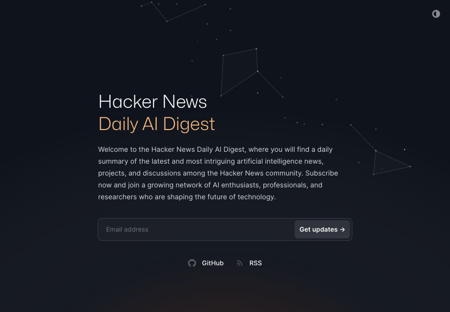

# Hacker News AI Digest

A daily digest of AI news, research, and projects shared on Hacker News.

[Read the digest](https://hackernews-ai-digest.vercel.app/) · [RSS feed](https://hackernews-ai-digest.vercel.app/rss/feed.xml)

Each edition pairs AI-generated summaries of linked stories with highlights from
the Hacker News discussions, with links to the original sources and comment threads.
Browse the archive, follow via RSS, or subscribe on the site for email updates.
